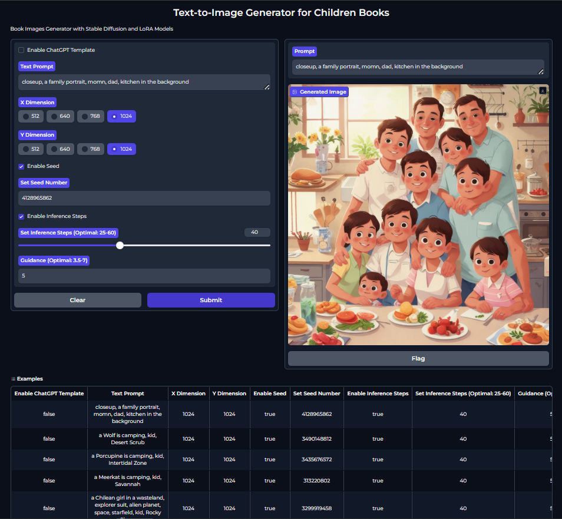

<h1 align="center"><strong>Contextual Diet ChatBot with Recommendation System</strong></h1>

<p align="center">
  
</p>

# LoRA-SD-Text2Image-ChildrenBooks-ChatGPT-Gradio

Welcome to the **LoRA-SD-Text2Image-ChildrenBooks-ChatGPT-Gradio** repository. This project aims to generate illustrations for each page of children's books using LoRA (Low-Rank Adaptation), Stable Diffusion, and a ChatGPT template. The project leverages Gradio for an interactive interface, allowing users to input prompts and customize image generation parameters.

## Repository Structure

This repository contains the following files:

1. **images/**: A directory containing example images generated from various prompts.
2. **Interface.PNG**: Screenshot of the Gradio interface (see above).
3. **Mehmet Alpay.pptx**: The presentation prepared for my graduation project.
4. **Poster.pptx**: The poster designed for the graduation project week.
5. **Rapor.docx**: The project report prepared for my graduation project.
6. **Text_to_Image_for_Children_Books.ipynb**: The Jupyter notebook containing the code to generate images using LoRA, Stable Diffusion, and the ChatGPT template.

## Project Overview

### Objective

The primary objective of this project is to generate high-quality illustrations for children's books. Each page of the book is converted into a prompt, which is then transformed into a Stable Diffusion prompt by the ChatGPT template. This prompt is used by a LoRA model, specifically trained on children's book illustrations, to generate corresponding images.

### Gradio Interface

The Gradio interface allows users to:

- **Input Prompts**: Enter text that describes the content of a book page.
- **Set Dimensions**: Customize the output image dimensions (X and Y).
- **Set Seed Number**: Ensure reproducibility by setting a seed number.
- **Set Inference Steps**: Control the number of inference steps during image generation.
- **Set Guidance**: Adjust the guidance scale for better output alignment with the prompt.
  
The interface also displays the generated prompt from ChatGPT and the resulting image. Below the main interface, an examples section is available for users to quickly test the model with pre-defined prompts.

## Getting Started

To explore the contents of this repository and run the application, follow these steps:

1. **Open in Google Colab**:
   - This project is designed to run seamlessly in Google Colab, where all necessary dependencies are installed automatically. You can open the `Text_to_Image_for_Children_Books.ipynb` notebook directly in Google Colab.

2. **Clone the Repository** (Optional):
   - If you prefer to run the project locally, clone this repository to your local machine using Git:

     ```bash
     git clone https://github.com/mehmetalpayy/LoRA-SD-Text2Image-ChildrenBooks-ChatGPT-Gradio.git
     ```

## Project Components

### LoRA (Low-Rank Adaptation)

LoRA is used to fine-tune the Stable Diffusion model specifically for generating illustrations in the style of children's books. This allows for efficient training and high-quality image generation.

### Stable Diffusion

Stable Diffusion is the core image generation model used in this project. It converts the text prompts into detailed and contextually appropriate images.

### ChatGPT Template

The ChatGPT template transforms user inputs into structured prompts that are optimized for use with the Stable Diffusion model, ensuring that the generated images accurately reflect the intended content of the children's book.

## Contributing

If you would like to contribute to this project, please follow these steps:

1. Fork the repository.
2. Create a new branch for your changes.
3. Make your modifications and commit them.
4. Submit a pull request with a detailed description of the changes.

## Contact

For any questions or feedback, please contact me at [mehmetcompeng@gmail.com](mailto:mehmetcompeng@gmail.com).

---

Thank you for visiting the LoRA-SD-Text2Image-ChildrenBooks-ChatGPT-Gradio repository. I hope you find the project useful and inspiring!
